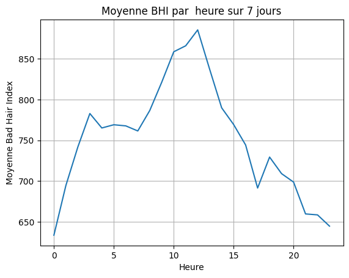
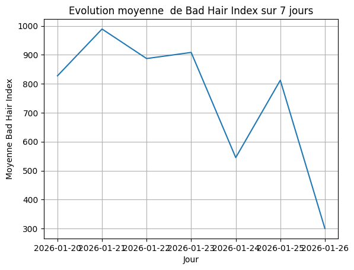

# 💇‍♀️ Projet : Prédictions Météo & "Bad Hair Index"

> **Rôle :** Analytics Engineer / Data Scientist  
> **Mission :** Construire un pipeline de données pour prédire les pires moments pour sortir, en se basant sur un indice capillaire (le *Bad Hair Index*).

---

## 📊 Aperçu des Résultats

L'objectif était de répondre à une question cruciale : **Quand rester chez soi pour sauver sa coiffure ?**

### 1. Analyse Heure par Heure : Le cycle d'une journée type
*Ce graphique permet d'identifier les créneaux horaires à risque.*


*(Assurez-vous que votre image s'appelle bien `hour.png` dans le dossier outputs)*

**🧐 Mon interprétation de Data Analyst :**
En analysant la courbe ci-dessus, on observe une tendance claire :
* **🔴 Zone Rouge (08h00 - 09h00) :** C'est le pic de risque (Index > 730). Le mélange d'humidité matinale et de vent rend ce créneau critique. *Conseil : Portez un bonnet pour aller au travail.*
* **🟢 Zone Verte (13h00) :** C'est le moment idéal (Index ~610). L'humidité chute souvent à la mi-journée, rendant l'air plus sec et plus clément pour les cheveux.
* **📈 Soirée :** Le risque remonte progressivement après 18h.

### 2. Analyse Jour par Jour : Planifier sa semaine
*Ce graphique permet de repérer le jour le plus hostile de la semaine.*


*(Assurez-vous que votre image s'appelle bien `day.png` dans le dossier outputs)*

---

## ⚙️ La Stack Technique

Ce projet met en œuvre un pipeline **ETL** (Extract, Transform, Load) complet en Python.

| Étape | Technologie | Description |
| :--- | :--- | :--- |
| **Extraction** | `Requests` | Appel de deux APIs : **Nominatim** (Géocodage) et **Open-Meteo** (Prévisions). |
| **Transformation** | `Pandas` | Nettoyage des JSON, conversion temporelle (`datetime`) et Feature Engineering (Calcul de l'index). |
| **Visualisation** | `Seaborn` | Création de graphiques statistiques pour l'analyse. |
| **Automatisation** | `OS` | Gestion automatique des dossiers de sauvegarde. |

---

## 📐 Structure du Projet

Le projet est organisé de manière professionnelle pour séparer le code, les tests et les résultats.

```text
03-projets_finaux/Prediction_meteo/
├── 📂 outputs/          # Stockage automatique des graphiques générés
│   ├── day.png          # Graphique journalier
│   └── hour.png         # Graphique horaire
├── 📄 main.ipynb        # Le Notebook contenant tout le pipeline logique
├── 📄 README.md         # La documentation (vous êtes ici)
└── 📄 .gitignore        # Fichiers à ignorer par Git

## 🧪 Méthodologie : Le calcul du "Bad Hair Index"

L'indice est calculé selon une formule personnalisée qui pondère l'impact de l'humidité relative et de la vitesse du vent :

$$Bad\ Hair\ Index = Humidité\ Relative (\%) \times Vitesse\ du\ Vent (km/h)$$

> **Interprétation :** Plus l'indice est élevé, plus la probabilité d'avoir une "mauvaise coiffure" (frisottis, décoiffage) est forte.


## 🚀 Comment lancer le projet ?

1. **Cloner le projet** ou télécharger le notebook.
2. **Installer les dépendances** via le terminal :
   ```bash
   pip install pandas seaborn matplotlib requests

3.Exécuter le pipeline dans le notebook main.ipynb :

```python
from main import main

# Lancer l'analyse pour n'importe quelle ville
main("France", "Montrouge", agg_var="hour")